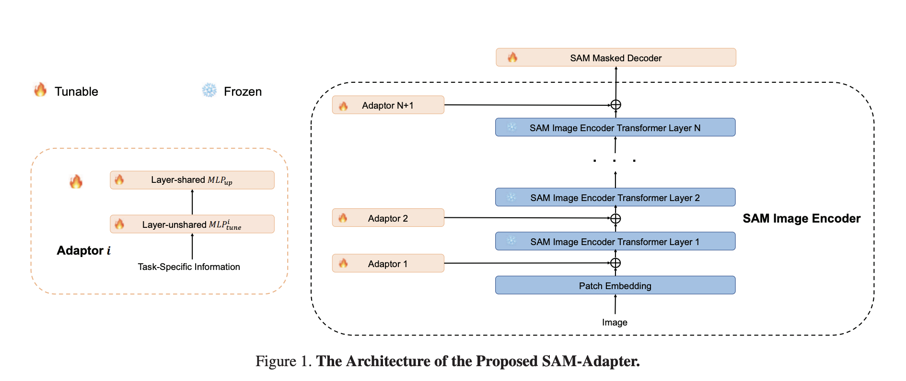

# SAM Adapter Pytorch Implementation

## Info 

> This document was translated into English using [Claude](https://claude.ai/).

This repository is a PyTorch implementation of **SAM Adapter** proposed in the paper "[SAM-Adapter: Adapting Segment Anything in Underperformed Scenes](https://openaccess.thecvf.com/content/ICCV2023W/VCL/papers/Chen_SAM-Adapter_Adapting_Segment_Anything_in_Underperformed_Scenes_ICCVW_2023_paper.pdf)". While an [official implementation](https://github.com/tianrun-chen/SAM-Adapter-PyTorch) exists, I have implemented it to be more user-friendly according to my standards.

You can see the architecture of the proposed SAM Adapter structure in the image below.



As proposed in the paper, I have implemented patch embedding tuning, high frequency component extraction using FFT & IFFT, and Layer-shared $\text{MLP}_{\text{up}}$. 

The dimensions of Patch Embedding tuning and Layer-unshared $\text{MLP}_{\text{tune}}$ were set arbitrarily and can be modified in ```run_sa.py```.

Besides SAM Adapter, the code for training basic Segment Anything was written with reference to my [previous repository](https://github.com/Kyyle2114/Fine-tuning-Segment-Anything).

Below is the explanation from the previous repository.

The training code mimics the operational process of the SamPredictor class from the [official SAM implementation](https://github.com/facebookresearch/segment-anything/blob/main/segment_anything/predictor.py). 

This repository supports **batch sizes $\ge$ 2** and **enables multi-GPU training** based on PyTorch's ```DistributedDataParallel```. Since the code is written with multi-GPU usage in mind, there may be a slight performance degradation when running on a single GPU. 

Since this repository was created for the need of segmentation on a single class and background, it can **only handle binary-class datasets** by default. That is, the input **GT mask y must have values of either 0 or 1.**

The input prompt for the mask decoder is automatically generated. **By default, a rectangle(box) is created** using ```cv2.boundingRect``` that completely contains the binary mask region. If you want to use different types of prompts, you can modify ```code/segment_anything_sa/utils/trainer.py```.

If you want to apply it to a multi-class dataset, modify ```code/segment_anything_sa/utils/trainer.py``` and ```code/segment_anything_sa/utils/dataset.py```. While I haven't implemented it myself, you can obtain multiple binary masks by one-hot encoding the GT mask y, and then obtain a box prompt for each mask.

If the validation score improves, it saves the model weights. However, saving the entire set of weights is inefficient, so **it only saves the parameters being trained**. For more details, refer to ```code/segment_anything_sa/utils/save_weight.py```. After loading the model with an existing checkpoint, you can load a part of the weights using ```load_partial_weight```.

All training processes are logged using **WandB(Weights & Biases)**. To modify the wandb project name, modify the ```--project_name``` argument.

## How to Use 

> To run the code, you need libraries such as ```numpy```, ```torch```, ```torchinfo```, ```wandb```, ```albumentations```

- [Download the checkpoint](https://github.com/facebookresearch/segment-anything?tab=readme-ov-file#model-checkpoints) corresponding to the model type(e.g., vit_b).
- Inside ```run.sh```, set the appropriate dataset path
- You can check the meaning of each argument in argparse at the top of ```run_sa.py```
- Running ```./run.sh``` will train the model

During model training, data augmentation based on ```albumentations``` is performed. If you want to modify this, edit ```run_sa.py```.

After model training is complete, the model weights are saved under the ```checkpoints/``` directory. The weight file name is saved based on the execution time (e.g., ```May21_172910.pth```). Rename this file to ```sam_sa.pth```.

If you want to evaluate the trained model, enter the test dataset path inside ```eval.sh```, then run the ```./eval.sh```.


If you use multiple gpus, the number of num_workers is set to 4 times the number of available GPUs. If you want to change this, modify opts.num_workers at the bottom of ```run_sa.py```.

For model training, BCELoss and IoULoss were used, and IoU and Dice were used as evaluation metrics. You can find the detailed implementation in ```code/segment_anything_sa/utils```. 

If you want to use different losses or evaluation metrics, modify ```run_sa.py``` and ```code/segment_anything_sa/utils/trainer.py```.

